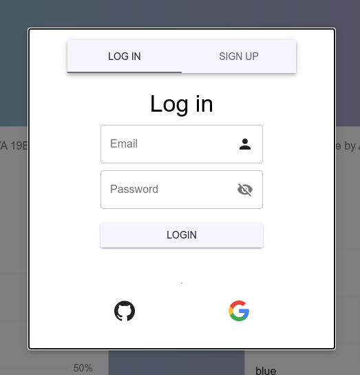
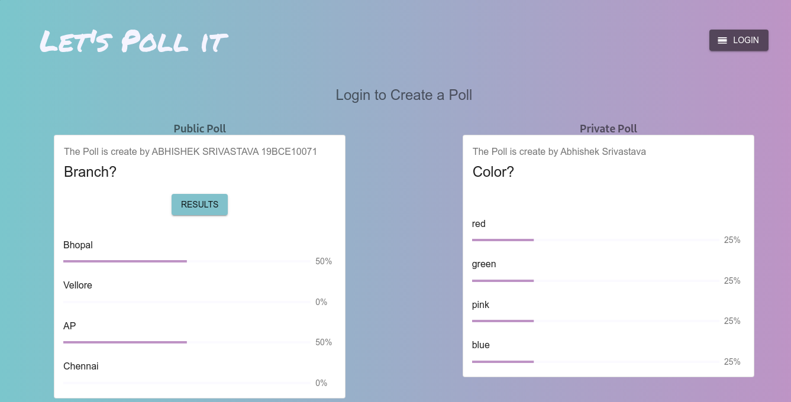

# Let's Poll

A polling Application where users can create private and public polls.

## Description

### Poll
A poll has a question and any number of options. 
The poll can be marked as public or private. 
Voting on any option will display the results of the active poll. For inactive poll (5 minutes expired since posting) display only the results

### Design

Logged in user can create new poll and look at his past created polls from his profile
Logged in user can also delete polls which have not expired
Logged out user can only vote

---

## Technology Stack

* React
* Material UI
* Firebase

---

## Initial Setup

* Fork and clone the repo
* run `npm i` or `yarn`

---

## Creating a PR

* git checkout -b '<branch-name>`
* Do Modifications.
* commit and push to forked repo.
* make a PR

---

## Deploy using firebaes

* `firebase init'
* Choose Hosting
* Use an existing project (select your project)
* directory: build
* SPA: Y
* npm run build
* firebase deploy

---

## Images

 

 

